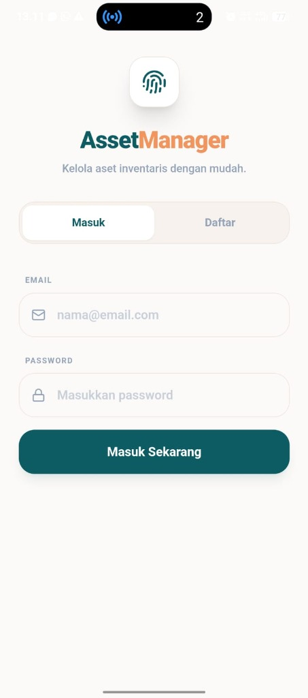
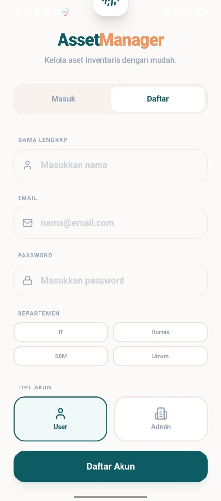
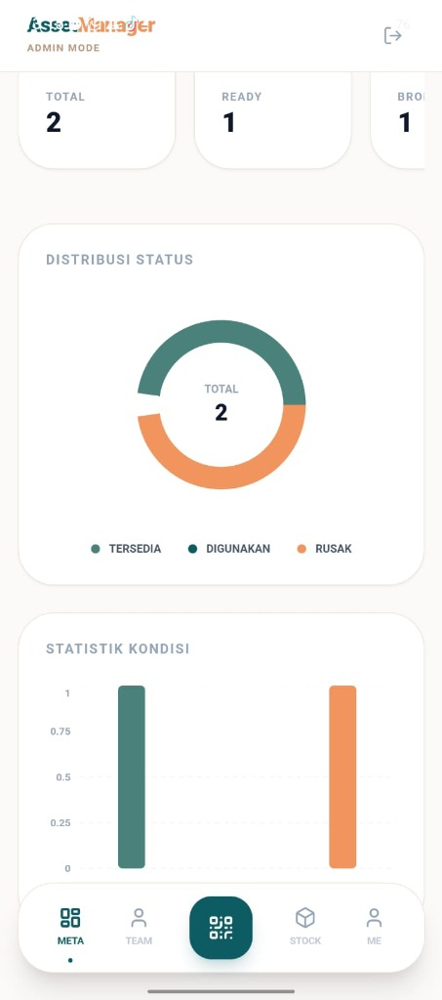
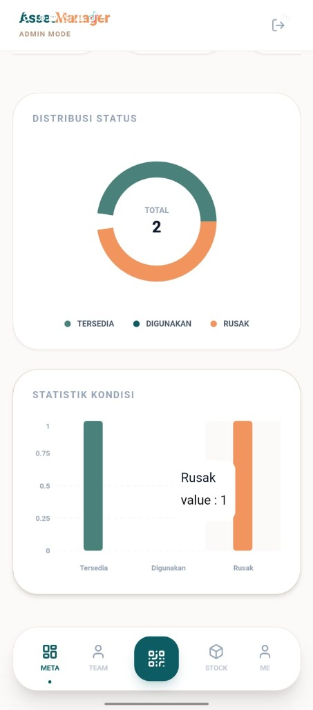

# AssetManager

AssetManager adalah aplikasi manajemen inventaris aset berbasis mobile yang dirancang untuk memudahkan pelacakan, pemantauan kondisi, dan manajemen stok barang dalam organisasi. Aplikasi ini dibangun menggunakan teknologi web modern dan dibungkus dengan Capacitor untuk penggunaan native di Android.

## Fitur Utama

- **Manajemen User & Role**: Dukungan untuk pengguna biasa dan Admin dengan hak akses berbeda.
- **Dashboard Interaktif**: Visualisasi data aset secara real-time (Total Aset, Aset Tersedia, Aset Rusak).
- **Statistik & Laporan**: Grafik kondisi aset (Pie Chart & Bar Chart) untuk pemantauan mudah.
- **Scanner QR Code**: Fitur scan QR Code untuk identifikasi aset secara cepat.
- **Manajemen Stok**: Pelacakan status barang (Tersedia, Digunakan, Rusak).
- **Autentikasi Aman**: Sistem Login dan Register yang terintegrasi.

## Teknologi

Project ini dibangun menggunakan stack berikut:

- **Frontend**: React, TypeScript, Vite
- **Styling**: Tailwind CSS, Lucide React
- **Mobile Runtime**: Capacitor (Android)
- **State/Data**: Firebase (Firestore/Auth)
- **Charts**: Recharts
- **Animation**: Framer Motion

## Demo Aplikasi

Berikut adalah tampilan antarmuka dari aplikasi AssetManager:

| Login Screen | Register Screen |
|:---:|:---:|
|  |  |

| Admin Dashboard | Statistik & Monitoring |
|:---:|:---:|
|  |  |

## Cara Menjalankan

1. **Install Dependencies**
   ```bash
   npm install
   ```

2. **Jalankan Development Server**
   ```bash
   npm run dev
   ```

3. **Build untuk Android**
   ```bash
   npm run build
   npx cap sync
   npx cap open android
   ```
